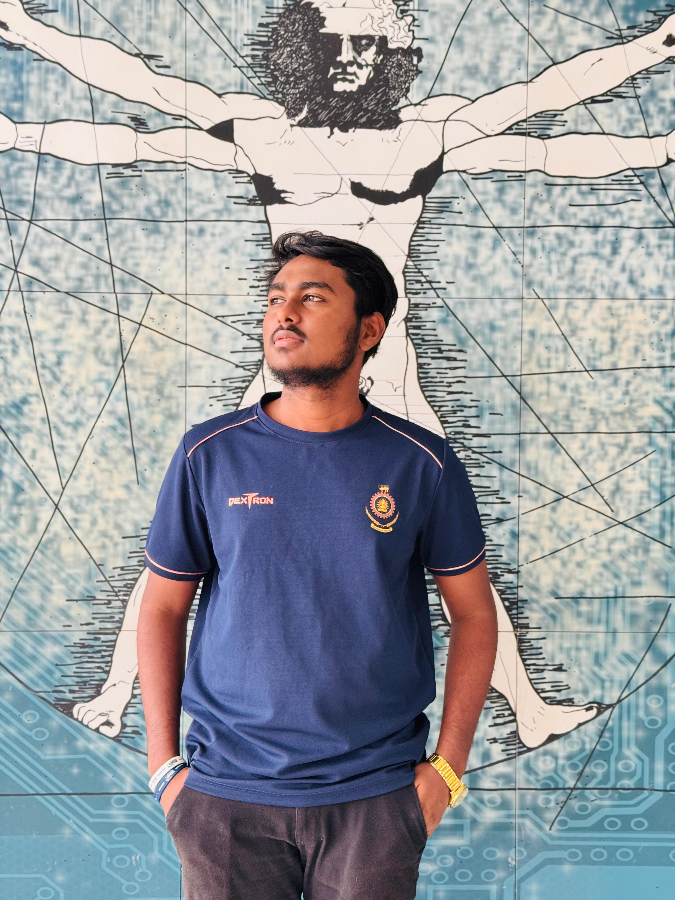

# 🚀 Shehan Madusanka - Portfolio Website

A modern, responsive portfolio website built with React, featuring smooth animations and an elegant design to showcase my skills and projects as a Full-Stack Developer.



## ✨ Features

- **Modern Design**: Clean, professional layout with gradient backgrounds and smooth animations
- **Responsive**: Fully responsive design that works on all devices
- **Interactive Animations**: Powered by Framer Motion for smooth, engaging user experience
- **Project Filtering**: Dynamic project filtering by technology stack
- **Contact Form**: Functional contact form with validation
- **Performance Optimized**: Fast loading and smooth animations

## 🛠️ Technologies Used

### Frontend
- **React 19** - Modern JavaScript library for building user interfaces
- **Vite** - Fast build tool and development server
- **Tailwind CSS** - Utility-first CSS framework for styling
- **Framer Motion** - Production-ready motion library for React
- **React Icons** - Popular icon library for React
- **React Router DOM** - Declarative routing for React

### Development Tools
- **ESLint** - Code linting and quality assurance
- **PostCSS** - CSS processing tool
- **Autoprefixer** - CSS vendor prefixing

## 🎨 Design Features

- **Animated Hero Section** with floating profile image and rotating backgrounds
- **Gradient Text Animations** for headings and titles
- **Hover Effects** on all interactive elements
- **Scroll-triggered Animations** for smooth page transitions
- **Interactive Skill Cards** with rotating icons
- **Project Cards** with image zoom and overlay effects
- **Smooth Page Transitions** between sections

## 📱 Sections

1. **Home** - Hero section with introduction and social links
2. **About** - Personal journey, education, and technical skills
3. **Projects** - Showcase of development projects with filtering
4. **Contact** - Contact form and information

## 🚀 Getting Started

### Prerequisites
- Node.js (v16 or higher)
- npm or yarn

### Installation

1. Clone the repository
```bash
git clone https://github.com/shehanmadusanka2002/myportfolio.git
cd myportfolio
```

2. Install dependencies
```bash
npm install
```

3. Start the development server
```bash
npm run dev
```

4. Open your browser and visit `http://localhost:5173`

### Build for Production

```bash
npm run build
```

### Preview Production Build

```bash
npm run preview
```

## 📂 Project Structure

```
myportfolio/
├── public/
│   ├── profile.jpg
│   ├── project1.jpg
│   ├── project2.jpg
│   └── project3.jpg
├── src/
│   ├── components/
│   │   ├── About.jsx
│   │   ├── Contact.jsx
│   │   ├── Footer.jsx
│   │   ├── Home.jsx
│   │   ├── Navbar.jsx
│   │   └── Projects.jsx
│   ├── data/
│   │   └── projectsData.js
│   ├── App.jsx
│   ├── App.css
│   ├── index.css
│   └── main.jsx
├── tailwind.config.js
├── vite.config.js
└── package.json
```

## 🎯 Key Components

### Home Component
- Animated hero section with floating elements
- Profile image with multiple animation layers
- Social media links with hover effects
- Call-to-action buttons

### About Component
- Animated skill cards with hover effects
- Journey timeline with smooth transitions
- Interactive technology tags
- Scroll-triggered animations

### Projects Component
- Dynamic project filtering system
- Animated project cards with hover effects
- Image zoom and overlay animations
- Technology stack highlighting

### Contact Component
- Form validation and error handling
- Animated form fields
- Contact information display
- Smooth submission animations

## 🌟 Animation Features

- **Framer Motion Variants** for consistent animation patterns
- **Spring Physics** for natural movement
- **Stagger Animations** for sequential element reveals
- **Hover Interactions** throughout the interface
- **Scroll-based Triggers** for performance optimization
- **Gradient Animations** for modern visual appeal

## 📧 Contact

- **Email**: shehan8998@gmail.com
- **Phone**: 0762388479
- **Location**: Matara, Sri Lanka
- **LinkedIn**: [Shehan Madhusanka](https://www.linkedin.com/in/shehan-madhusanka-952523305/)
- **GitHub**: [shehanmadusanka2002](https://github.com/shehanmadusanka2002)
- **Facebook**: [Shehan Madushanka](https://web.facebook.com/shehan.madushanka.171211)

## 🎓 About Me

I'm currently pursuing my Diploma in Information Technology at the Institute of Technology University of Moratuwa (2022-2024). I'm passionate about full-stack development, creating user-friendly interfaces, and building robust backend systems.

### Skills
- **Frontend**: React, Next.js, Tailwind CSS, JavaScript, HTML5, CSS3
- **Backend**: Spring Boot, Node.js, Express.js, RESTful APIs, JWT Authentication
- **Database**: MySQL, MongoDB, PostgreSQL, Firebase
- **Tools**: Git, Docker, AWS, Postman, Figma, VS Code

## 📄 License

This project is open source and available under the [MIT License](LICENSE).

## 🤝 Contributing

Contributions, issues, and feature requests are welcome! Feel free to check the [issues page](https://github.com/shehanmadusanka2002/myportfolio/issues).

## ⭐ Show Your Support

Give a ⭐️ if you like this project!

---

**Built with ❤️ by Shehan Madusanka**
